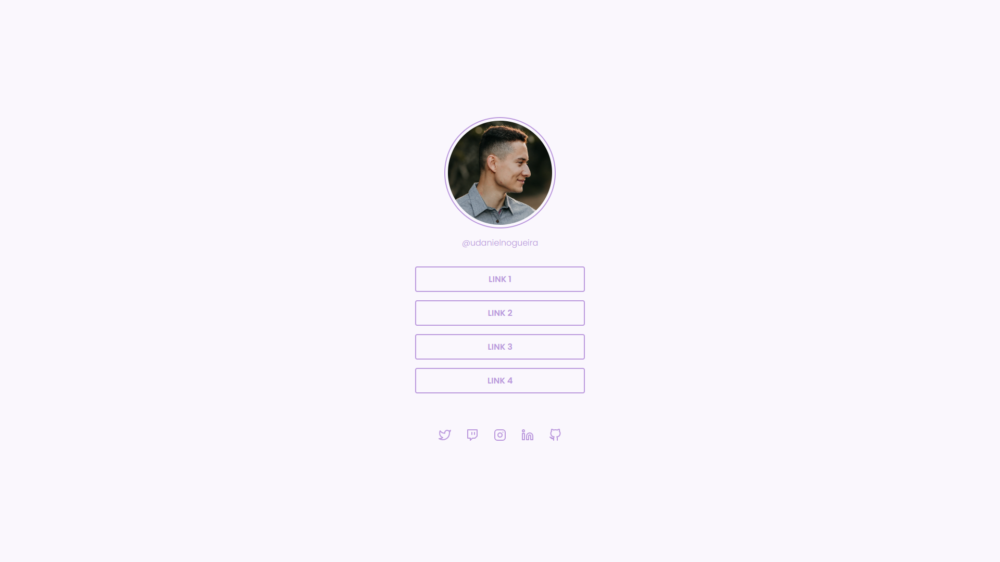

<h3>Social Tree</h3>

Página com lista de links para redes sociais.

## Preview

### Desktop 

### Mobile

## Tecnologias

- HTML5
- CSS3
- Figma

## Link de acesso

<a href="https://udanielnogueira.github.io/social-tree/" target="_blank">Portfolio Dashboard</a>

## Layout do Projeto

<a href="https://www.figma.com/file/xm70w668XkJnMFm6JjuIQI/DD-Social-links">Layout do Portfolio Dashboard</a>

<!-- 
Images

 -->

 <!-- 
Gifs
Windows + G
Windows + Alt + R
https://cloudconvert.com/mp4-to-gif
https://www.iloveimg.com/compress-image/compress-gif
-->

<!-- 
Badges
https://shields.io/
https://simpleicons.org/
https://forthebadge.com/
https://github.com/alexandresanlim/Badges4-README.md-Profile
 -->

<!-- 
Logos
https://temp-mail.org/en/
https://www.shopify.com/br/ferramentas/criador-de-logo
-->

<!-- 
Refs
https://github.com/othneildrew/Best-README-Template
https://github.com/matiassingers/awesome-readme
https://github.com/amitmerchant1990/electron-markdownify
 -->